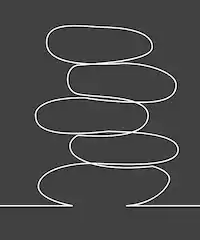

 

Finding Equa & Nimity
=======

## Introduction

*"Equanimity (Latin: æquanimitas, having an even mind; aequus even; animus mind/soul) is a state of psychological stability and composure which is undisturbed by experience of or exposure to emotions, pain, or other phenomena that may cause others to lose the balance of their mind."*
[Wikipedia](https://en.wikipedia.org/wiki/Equanimity)

Game constructed in HTML5 canvas, using javascript

### History

"Equa" is a little child with 3 years old, she doesn't sleep without her plush cat "Nimity".
In one raining night, the light is off, and Equa is hidden your self in the house, because can't find Nimity.
Our hero need to find Equa and Nimity in the darkness.

## Game 

The consiste in a maze where you need to fasted find two characters who appear randomly on the maze.
Every player start with 100,000 of score, that score decrease a long the time, when one of the characters is founded the is score is increased the same value the player have in that moment.
```
Hero.prototype.detectEquaNimity = function (argEqua, argNimity) {
  if (this.posX < argEqua.posX + 20
    && this.posX + 20 > argEqua.posX
    && this.posY < argEqua.posY + 20
    && 20 + this.posY > argEqua.posY) {
    this.equa = true;
    **this.score += this.score;**
    equaFound.load();
    equaFound.play();
    argEqua.posX = 0;
    argEqua.posY = 0;
  }
  if (this.posX < argNimity.posX + 20
    && this.posX + 20 > argNimity.posX
    && this.posY < argNimity.posY + 20
    && 20 + this.posY > argNimity.posY) {
    this.nimity = true;
    **this.score += this.score;**
    nimityFound.load();
    nimityFound.play();
    argNimity.posX = 0;
    argNimity.posY = 0;
  }
};
```

## Dones and ToDo`s

- [x] Engine of game
- [x] Carachters images
- [x] Sound Efects
- [x] Score compare 2 players
- [ ] Darkness, only see where is light
- [ ] Works in mobile
- [ ] Add more functions when find one caracter~
- [ ] Random Maze


## Author

[Gabriel Sicuto](https://github.com/gsicuto)


